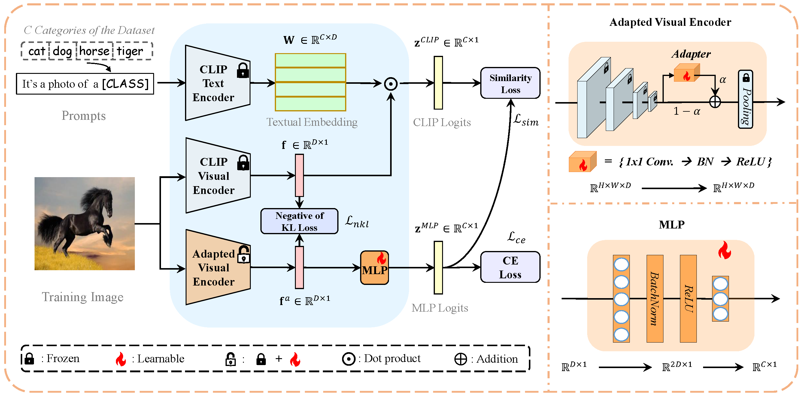
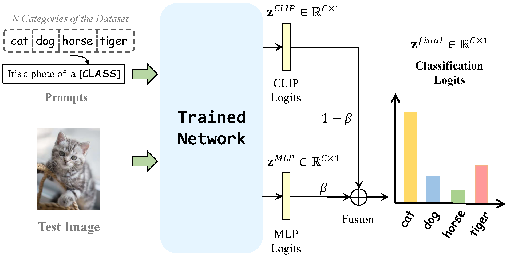

# Feature Adaptation with CLIP for Few-shot Classification

Official implementation of "Feature Adaptation with CLIP for Few-shot Classification".

The paper has been accepted by **[ACM Multimedia Asia 2023](http://www.mmasia2023.org/index.html)**.

## Introduction

We propose FAR, a novel approach that balances distribution-altered
**F**eature **A**daptation with p**R**ior knowledge of CLIP to further
improve the performance of CLIP in few-shot classification tasks.
Firstly, we introduce an adapter that enhances the effectiveness of
CLIP adaptation by amplifying the differences between the fine-tuned
CLIP features and the original CLIP features. Secondly, we
leverage the prior knowledge of CLIP to mitigate the risk of overfitting.
Through this framework, a good trade-off between feature
adaptation and preserving prior knowledge is achieved, enabling
effective utilization of the strengths of both components to enhance
performance on downstream tasks. 

- train stage


<div align="center">
  
</div>

- test stage

<div align="center">
  
</div>

## Requirements
### Installation
Create a conda environment and install dependencies:
```bash
git clone https://github.com/WideStars/FAR.git
# or using ssh: git clone git@github.com:WideStars/FAR.git
cd FAR

# conda create -n FAR python=3.8
# conda activate FAR
# for torch version, we use 2.0.0+cu117

pip install -r requirements.txt
```

### Dataset
Follow [DATASET.md](./doc/DATASET.md) to install ImageNet and other 10 datasets referring to [CoOp](https://github.com/KaiyangZhou/CoOp).

## Get Started
### Configs
The running configurations can be modified in `configs/dataset.yaml`, including shot numbers, visual encoders, and hyperparamters. And you can also change more arguments in the scripts under the [folder](./scripts/).

### Running
For ImageNet dataset:
```bash
bash ./scripts/train_imagenet.sh
```
We do the evaluation automatically at the end of training. If you want to evaluate seperately, you can also run:
```bash
bash ./scripts/test_imagenet.sh
```
For other 10 datasets:
```bash
bash ./scripts/train_other_datasets.sh
```

## Acknowledgement
This repo benefits from [CLIP](https://github.com/openai/CLIP), [CoOp](https://github.com/KaiyangZhou/CoOp) and [Tip-Adapter](https://github.com/gaopengcuhk/Tip-Adapter). Thanks for their wonderful works.

